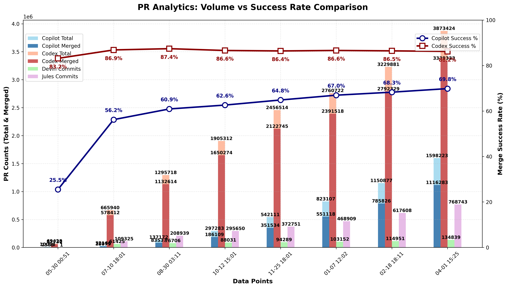

### PR Analytics: Volume vs Success Rate (auto‑updated)

View the [interactive dashboard](https://aavetis.github.io/ai-pr-watcher/) for these statistics.

## Data sources

Explore the GitHub search queries used:

- **All Copilot PRs**: [is:pr head:copilot/](https://github.com/search?q=is:pr+head:copilot/&type=pullrequests)
- **Merged Copilot PRs**: [is:pr head:copilot/ is:merged](https://github.com/search?q=is:pr+head:copilot/+is:merged&type=pullrequests)
- **All Codex PRs**: [is:pr head:codex/](https://github.com/search?q=is:pr+head:codex/&type=pullrequests)
- **Merged Codex PRs**: [is:pr head:codex/ is:merged](https://github.com/search?q=is:pr+head:codex/+is:merged&type=pullrequests)

---

## Current Statistics

| Service | Total PRs | Merged PRs | Merge Rate | Total Commits |
| ------- | --------- | ---------- | ---------- | ------------- |
| Copilot | 439,394 | 283,050 | 64.42% | N/A           |
| Codex   | 2,297,690 | 1,985,152 | 86.40% | N/A           |
| Devin   | N/A       | N/A        | N/A        | 94,235 |
| Jules   | N/A       | N/A        | N/A        | 346,577 |